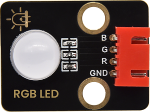

# 实验34：超声波雷达

**实验介绍：**

我们知道，蝙蝠飞行与获取猎物是通过回声定位的。在现实生活中有种在水里专用的电子设备：声呐，一种声学探测设备，由于
电磁波在水中衰减的速率非常的高，无法做为侦测的讯号来源，因此以声波探测水面下的人造物体成为运用最广泛的手段在水中进行观察和测量，具有得天独厚条件的只有声波。

在前面实验中，我们学会了控制RGB模块发出彩色光；也学会了利用功放喇叭模块发出不同频率的声音及播放音乐，我们也学会了利用超声波传感器检测前方障碍物的距离，也会用四位数码管来显示检测数据；如果说，我们把这几个模块结合起来呢？我们利用距离大小控制功放喇叭模块模块响起对应频率的声音和RGB亮起对应颜色，然后把这个距离显示在四位数码管上。这就搭建好了一个简易的超声波雷达系统。

**实验元件：**

|  |   |   |  |  |
| ----------------------------------------------- | ------------------------------------------------ | ------------------------------------------------ | ----------------------------------------------- | ----------------------------------------------- |
| Raspberry Pi Pico板*1                           | Raspberry Pi Pico扩展板*1                        | HC-SR04超声波传感器*1                            | keyes DIY电子积木 8002b功放 喇叭模块*1          | keyes DIY电子积木 共阴RGB模块*1                 |
|  |  |  |  |                                                 |
| keyes DIY电子积木 TM1650四位数码管模块*1        | 防反插4Pin*3                                     | 防反插3Pin*1                                     | MicroUSB线*1                                    |                                                 |

**实验接线图：**

**运行示例代码：**

找到Ultrasonic radar.py，然后双击打开代码，再点击运行代码

**代码说明：**

设置时，我们通过调节不同距离范围，设置声音频率和灯光颜色。为方便控制障碍物距离，我们可以在上面代码中，根据实际情况，在控制逻辑里调节距离范围。

**实验结果：**

按照接线图接好线，运行测试代码，超声波传感器检测到障碍物不同距离时，外接功放喇叭模块上蜂鸣器响起不同频率的声音、RGB亮起不同的颜色，并且测得的距离显示在四位数码管上。

