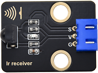

# 实验35：红外遥控灯

**实验介绍：**

大家生活中不知道有没有这个场景，当我们快要入睡的时候，还没有关灯，然而灯的开关又比较远，当我们起床去关灯，又影响了我们入睡，这个时候大家是不是希望有个遥控器能遥控电视一样来控制灯光，这样就方便多了。在前面实验中，我们学会了点亮或熄灭LED、利用PWM技术调节灯光的亮度；实验二十一，我们学会了使用红外接收模块，并把接收到的遥控器的信息打印了出来。那么在这个实验中，我们就用红外遥控接控制我们的LED模块亮灭和亮度。

当我们接收到一个按键值时，我们通过对应按键值来设置输出的PWM值，这样就可以设置亮度了，控制LED亮灭也一样，但是如果说，在控制LED亮灭这里，我们用同一个按键来控制LED的亮与灭，就需要一个灵活的编程技巧了。我们可以先自己思考，再来看程序。

**实验元件：**

|  |  |   |  |
| ----------------------------------------------- | ----------------------------------------------- | ------------------------------------------------ | ----------------------------------------------- |
| Raspberry Pi Pico板*1                           | Raspberry Pi Pico扩展板*1                       | keyes DIY电子积木 白色LED模块*1                  | keyes DIY电子积木 红外接收模块*1                |
|  |  |  |                                                 |
| MicroUSB线*1                                    | 遥控器*1                                        | 防反插3Pin*2                                     |                                                 |

**实验接线图：**

**运行示例代码：**

找到IR control LED.py，然后双击打开代码，再点击运行代码

**代码说明：**

1\.与前面定义变量不同，这里我们定义一个布尔变量，布尔变量的值只有两个，真（True）或者假（False）。

2\.我们按下OK键时，红外接收返回的键为：“OK”，此时我们需要设置一个布尔变量flag，flag为真(True)的时候点亮LED，为假(False)的时候熄灭LED，点亮LED后我们又把它设置为假，这样当下次按下OK键时，LED将熄灭。

**实验结果：**

按照接线图接好线，运行测试代码，观察Shell。按下遥控器按钮，显示我们按下的值，按下ok键点亮LED，再次按下熄灭LED。

