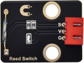

# 实验6：干簧管模块

**实验介绍：**

在这个套件中，有一个Keyes DIY电子积木 干簧管模块，它主要采用MKA10110
绿色磁簧元件元件。簧管是干式舌簧管的简称，是一种有触点的无源电子开关元件，具有结构简单，体积小便于控制等优点。它的外壳是一根密封的玻璃管，管中装有两个铁质的弹性簧片电板，还灌有一种惰性气体。

实验中，我们通过读取模块上S端高低电平，判断模块附近是否存在磁场；并且，我们在shell打印测试结果。

**实验原理：**

平常状态下，玻璃管中的两个由特殊材料制成的簧片是分开的，此时信号端S被R2拉为高电平，LED熄灭。当有磁性物质靠近玻璃管时，在磁场磁力线的作用下，管内的两个簧片被磁化而互相吸引接触，簧片就会吸合在一起，使结点所接的电路连通，即信号端S连通GND，此时LED点亮。外磁力消失后，两个簧片由于本身的弹性而分开，线路也就断开了。该传感器就是利用元件这一特性，搭建电路将磁场信号转换为高低电平变换信号。

**实验元件：**

|  |  |  |  |  |
| ----------------------------------------------- | ----------------------------------------------- | ----------------------------------------------- | ------------------------------------------------ | ----------------------------------------------- |
| Raspberry Pi Pico板*1                           | Raspberry Pi Pico扩展板*1                       | keyes DIY电子积木 干簧管模块*1                  | 防反插3Pin*1                                     | MicroUSB线*1                                    |

**实验接线图：**

**运行示例代码：**

找到Reed Switch.py，然后双击打开代码，再点击运行代码

**代码说明：**

设置方法和前面实验相同，需要区分的是，这里是检测磁场

**实验结果：**

运行测试代码，观察软件下方Shell。显示对应数据和字符。实验中，当传感器检测到磁场时，val为0且模块红色LED点亮，显示“0 A magnetic field”字符；没有检测到磁场时，val为1，模块上LED熄灭，显示“1 There is no magnetic field”字符。

