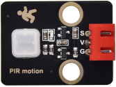

# 实验7：人体红外热传感器

**实验介绍：**

在这个套件中，有一个Keyes DIY电子积木
人体红外热释传感器，它主要采用RE200B-P传感器元件。它是一款基于热释电效应的人体热释运动传感器，能检测到人体或动物身上发出的红外线，配合菲涅尔透镜能使传感器探测范围更远更广。

实验中，我们通过读取模块上S端高低电平，判断附近是否有人在运动；并且，我们在shell打印测试结果。

**实验原理：**

这个原理图可能较前面的模块稍复杂，我们一个个来看。左上角那部分是电压转换，VCC转3.3V，因为我们模块上用到的传感器工作电压为3.3V，不能直接用5V供电，所以需要一个电压转换电路，所以这个模块我们也可以在5V的单片机使用，如Arduino。当传感器附近没有检测到人即没有接收到红外信号时，传感器1脚输出低电平，此时模块上LED两端有电压就会点亮，此时MOS管Q1导通，信号端S检测到低电平。当传感器附近检测到人即接收到红外信号时，传感器1脚输出高电平，此时模块上LED两端没有电压就会熄灭，此时MOS管Q1不导通，信号端S则检测到被10K上拉电阻R5拉高的高电平。

**实验元件：**

|  |  |  |  |  |
| ----------------------------------------------- | ----------------------------------------------- | ----------------------------------------------- | ------------------------------------------------ | ----------------------------------------------- |
| Raspberry Pi Pico板*1                           | Raspberry Pi Pico扩展板*1                       | keyes DIY电子积木 人体红外热释传感器*1          | 防反插3Pin*1                                     | MicroUSB线*1                                    |

**实验接线图：**

**运行示例代码：**

找到PIR motion.py，然后双击打开代码，再点击运行代码

**代码说明：**

设置方法和实验三类似，这里就不多做介绍了。

**实验结果：**

运行测试代码，观察软件下方Shell。显示对应数据和字符。实验中，传感器检测到附近有人在运动时，value为1，模块上LED熄灭，打印“1 Somebody is in this area!”字符；没有检测到人运动时，value为0，模块上LED点亮，打印“0 No one!”字符。

