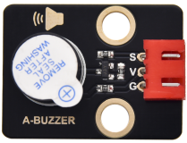

# 实验8：有缘蜂鸣器

**实验介绍：**

在这个套件中，包含一个有源蜂鸣器模块，一个功放模块（原理相当于无源蜂鸣器）。这个实验中，我们控制有源蜂鸣器发出声音。有源蜂鸣器元件内部自带震荡电路，控制时，我们只需要给蜂鸣器元件足够的电压，蜂鸣器就自动响起。

实验中，我们只是控制这个模块上有源蜂鸣器的循环响起声音。

**实验原理：**

从原理图中可以看出来在，蜂鸣器一端通过串联一个电阻R2连接到电压正极，另一端通过一个NPN三极管Q1连接到GND，所以只要导通这个三极管，让蜂鸣器一端连通GND，有缘蜂鸣器就会响起来。三极管控制端基极也就是连接到R1电阻一端为高电平，三极管Q1就导通了，三极管基极被下拉电阻R3拉低，所以常态为不导通，当我们用单片机IO口输出一个高电平到基极三极管就导通了。

即S信号端设置为高电平时，三极管导通，模块上蜂鸣器响起；设置为低电平时，三极管不导通，模块上蜂鸣器没有声音。

**实验元件：**

|  |  |  |  |  |
| ----------------------------------------------- | ----------------------------------------------- | ----------------------------------------------- | ------------------------------------------------ | ----------------------------------------------- |
| Raspberry Pi Pico板*1                           | Raspberry Pi Pico扩展板*1                       | keyes DIY电子积木 有源蜂鸣器模块*1              | 防反插3Pin*1                                     | MicroUSB线*1                                    |

**实验接线图：**

**运行示例代码：**

找到A-buzzer.py，然后双击打开代码，再点击运行代码

**代码说明：**

在实验中，我们把管脚设置为20，设置为高时，模块上有源蜂鸣器响起；设置为低时，模块上有源蜂鸣器关闭声音。

**实验结果：**

运行测试代码成功，上电后，模块上有源蜂鸣器响起1秒，关闭1秒，循环交替。

**示例代码：**

'''

\* Keyes Starter Kit for Raspberry Pi Pico

\* lesson 8

\* Active buzzer

'''

from machine import Pin

import time

buzzer = Pin(20, Pin.OUT)

while True:

buzzer.value(1)

time.sleep(1)

buzzer.value(0)

time.sleep(1)